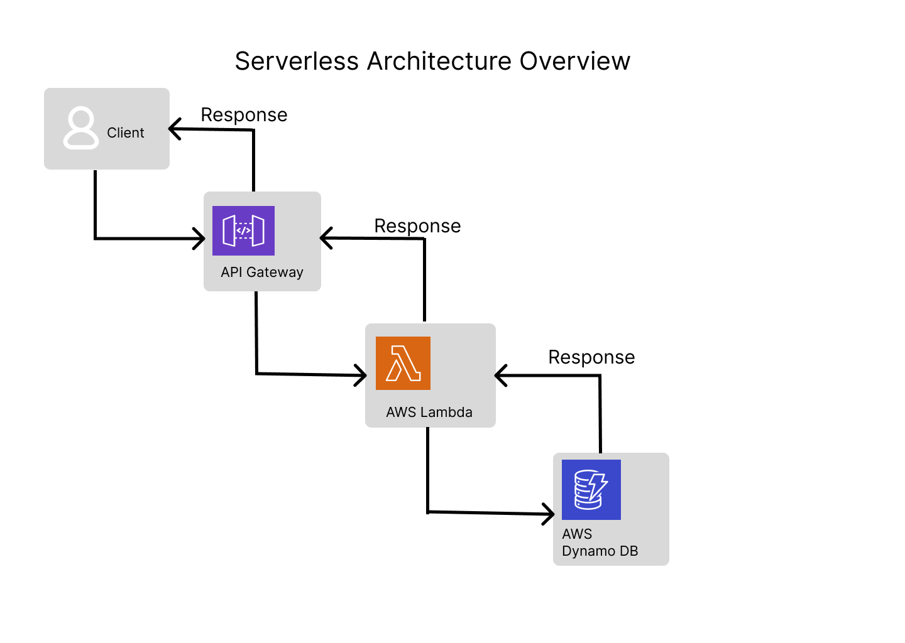

# Serverless To-Do List Application (AWS)

A serverless personal To-Do List application built using AWS services.  
The project demonstrates how to build a scalable, cost-effective backend using AWS Lambda, API Gateway, and DynamoDB without managing servers.

---

## 🚀 Serverless Architecture Overview



Client → API Gateway → AWS Lambda → DynamoDB

The application follows an event-driven, serverless architecture where each HTTP request is routed through Amazon API Gateway, processed by AWS Lambda, and persisted in DynamoDB.

---

## 🛠 AWS Services Used

- **AWS Lambda** – Backend logic for CRUD operations  
- **Amazon API Gateway** – REST API endpoints  
- **Amazon DynamoDB** – NoSQL database for task storage  
- **AWS IAM** – Secure access between services  
- **Amazon CloudWatch** – Logs and monitoring  

---

## 📌 Features

- Create a task  
- Retrieve all tasks  
- Update an existing task  
- Delete a task  
- Fully serverless (no EC2 / no server management)

---

## 🔗 API Endpoints

| Method | Endpoint | Description |
|------|--------|------------|
| POST | `/todo` | Create a new task |
| GET | `/todo` | Get all tasks |
| PUT | `/todo` | Update a task |
| DELETE | `/todo?id=1` | Delete a task by ID |

---

## ▶️ How to Test the API

The API endpoints can be tested using **Postman** or any REST client.

**Example – Create Task (POST):**
```json
{
  "id": "1",
  "task": "Learn Serverless AWS"
}

## 👤 Author

**Nikhil Singh**
